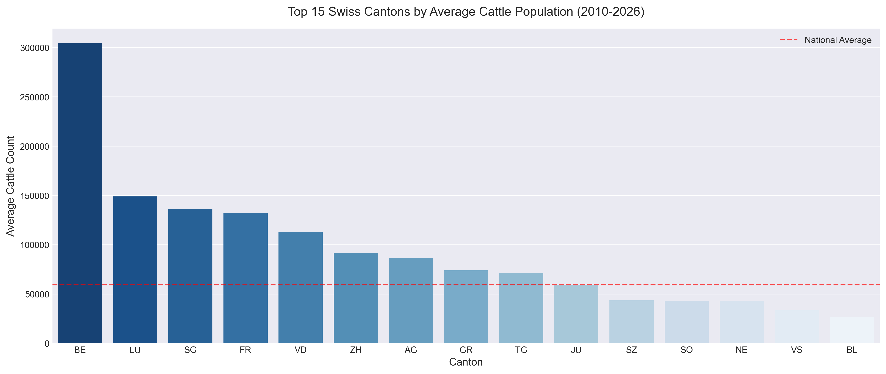
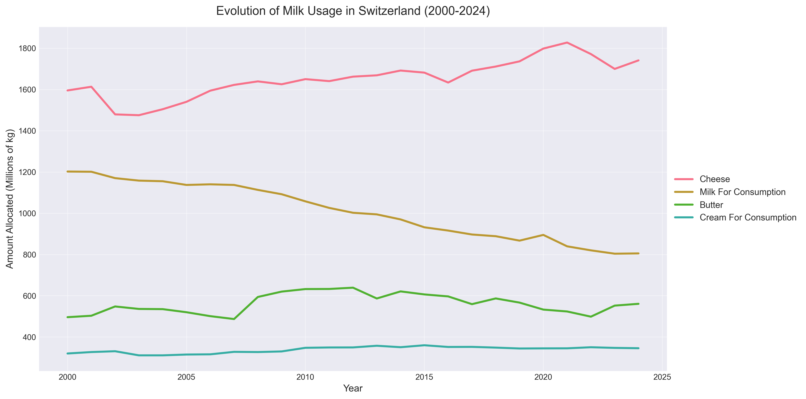
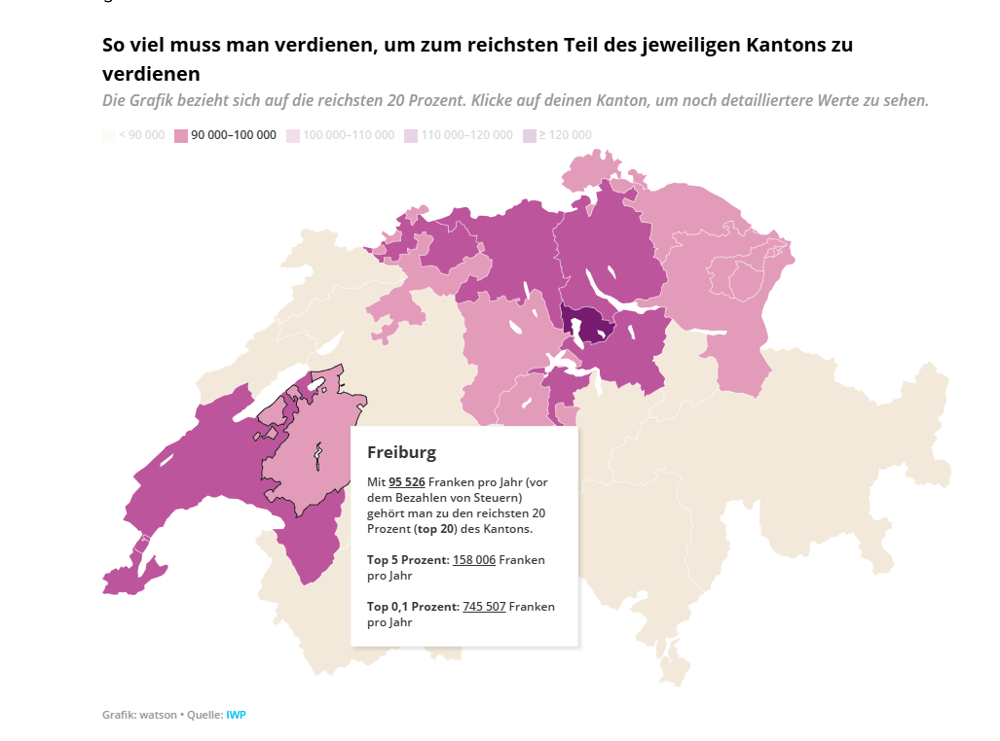
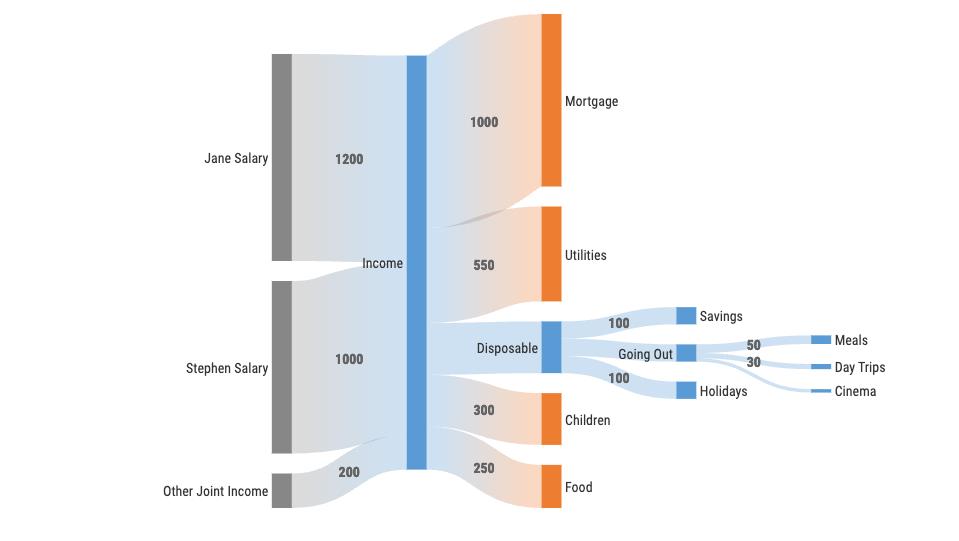

# Project of Data Visualization (COM-480)

| Student's name | SCIPER |
| -------------- | ------ |
| Robin Herberich | 355741 |
| Antoine Emmanuel Bachmann | 336641 |
| Asia Montico | 423356 |

[Milestone 1](#milestone-1-20th-march-5pm) • [Milestone 2](#milestone-2-17th-april-5pm) • [Milestone 3](#milestone-3-29th-may-5pm)

## Milestone 1 (20th March, 5pm)

**10% of the final grade**

This is a preliminary milestone to let you set up goals for your final project and assess the feasibility of your ideas.
Please, fill the following sections about your project.

*(max. 2000 characters per section)*

### Datasets

#### 1. Evolution of the usage of milk in Switzerland (1999-2024)
**Link :** https://opendata.swiss/en/dataset/verwertung-der-gemolkenen-kuhmilch4

XLS, not machine readable formatting, manual conversion to CSV necessary, no special cleaning or processing needed except for removing 1999 since it does not have the same categories as the rest of the data.

#### 2. Evolution of the number of cows by usage (Switzerland)
**Link :** https://opendata.swiss/en/dataset/rinder-entwicklung-nach-nutzungsarten

CSV, no special cleaning or processing necessary.

#### 3. Evolution of the number of cows by canton  (Switzerland)
**Link :** https://opendata.swiss/en/dataset/rinder-entwicklung-nach-kantonen

CSV, no special cleaning or processing necessary.

#### 4. Monthly milk producer prices (Switzerland)
**Link :** https://opendata.swiss/en/dataset/marktzahlen-milch-undmilchprodukte-4

SPARQL backend, needs to be queried, returns a CSV, no special cleaning or processing necessary.

#### 5. Monthly consumer prices for different dairy products (Switzerland)
**Link :** https://opendata.swiss/en/dataset/marktzahlen-milch-undmilchprodukte-9

SPARQL backend, needs to be queried, returns a CSV, large dataset that may need light cleanup, generally good data.

#### 6. Monthly average heard size by usage (Switzerland) 
**Link :** https://opendata.swiss/en/dataset/rinder-herdengrossen-der-tierhaltungen-nach-nutzungsart

CSV, no special cleaning or processing necessary.

#### 7. Monthly average heard size and number of holdings (Switzerland) 
**Link :** https://opendata.swiss/en/dataset/rinder-herdengrossen-der-tierhaltungen

CSV, no special cleaning or processing necessary.

#### 8. MenuCH study, dairy consumption in switzerland (2015) 
**Link :** https://opendata.swiss/de/dataset/menuch_lebensmittelkonsum/resource/ca928bd5-95c4-47d5-8c95-8e1d62dd6e22

XLS, not machine readable formatting, manual conversion to CSV necessary.

#### 9. Top names of female cows by language region (Switzerland)
**Link :** https://opendata.swiss/en/dataset/rinder-namen-der-weiblichen-rinder

CSV, no special cleaning or processing necessary.

We chose a wide array of smaller datasets regarding Swiss dairy production, consumption, and prices, enabling us to combine diverse sources to generate new insights and a comprehensive picture of the industry.

### Problematic

1. General Topic & Main Axis:

    How have shifting economic factors, mainly the widening gap between consumer and producer prices, influenced the swiss dairy industry (average number of cows per farm, number of holdings, etc...) and are there differences between different regions ?

2. What we want to show:

    Over the past 25 years, economical difficulties have changed the logistical and productive landscape of swiss dairy. By plotting economic divergence (the price gap) alongside demographic agricultural data, the visualization will show a clear trend line: as profitability margins shrink, farms are forced to either close or scale up, leading to fewer, larger, and potentially regionally concentrated operations.
    
3. Target audience and motivation:
    
    This would mostly be of interest to businesses, especially suppliers and producers who might be able to cross-reference the project with arable land/available cattle to guess at longer term trends. By visualizing this past quarter-century of data, we create a baseline to understand the current limits of Swiss agricultural capacity.

#### Exploratory Data Analysis

Our EDA focused on cleaning heterogeneous datasets and extracting preliminary statistics to validate our core problematic: the structural and economic shift in the Swiss dairy industry. 

**Data Pre-processing:** 
We standardized 9 distinct datasets (CSV and Excel). A major task involved transforming wide-format government data into tidy, long-format structures using `pandas.melt()` to enable time-series analysis. Date columns were unified, and high-granularity data (e.g., monthly milk allocation) was aggregated annually to smooth out seasonal volatility and reveal clear macro-trends.

**Key Insights & Statistics:**
1. **Geographic Specialization:** Cattle distribution is highly concentrated. The top 5 cantons (led by Bern with an average of ~304k cattle) account for 54.0% of the national herd. This spatial inequality strongly motivates our planned interactive map visualization.
 
    

2. **Farm Consolidation:** We observed a stark structural shift over the last two decades. While the total number of agricultural holdings is steadily declining, the median herd size per farm is inversely increasing. This confirms our hypothesis: shrinking margins force smaller farms to close, driving a scale-up in surviving operations.
 
        

3. **Economic Divergence:** Initial comparisons of price indices reveal the anticipated decoupling between producers and consumers. Raw milk producer prices remain volatile and stagnant, while retail prices for processed dairy have climbed, visually highlighting the economic squeeze on farmers.

4. **Strategic Usage Shifts:** Time-series analysis of milk allocation shows a strategic pivot. Liquid milk consumption is declining, offset by a steady increase in raw milk allocated to high-margin products like cheese (from ~167M kg to >200M kg).

5. **Cultural Narrative:** We pre-processed regional cow names (e.g., Fiona, Bella) to serve as an engaging, relatable entry point for the user, bridging hard economic data with Swiss agricultural culture.

### Related work

[Swissmilk article](https://www.swissmilk.ch/fr/producteurs-de-lait/marche/acteurs-et-structure-du-marche/producteurs-de-lait/) about dairy in Switzerland

#### Why is our approach original?
Most websites and visualizations about this topic are a bit old, use static charts and only highlight single metrics. 
- Rather than viewing production, pricing, and consumption separately, we will correlate these diverse datasets to reveal hidden relationships. For example, we can visually link the evolution of herd sizes and milk usage with the growing gap between producer and consumer prices, while also weaving in cultural elements like regional cow names to keep the narrative engaging
- We will create dynamic visualizations that let the user explore the data by themselves, which is a lot more fun than static charts that only provide a narrow way of interacting with the topic.
#### Inspiration
1. Interactive canton map for showcasing cantonal data (number of cows per canton)

    
    
    Source: https://www.watson.ch/schweiz/arbeitswelt/438746096-du-willst-wissen-wer-in-deinem-kanton-als-reich-gilt-wir-zeigen-es-dir

    We can extend this with a timeline slider to show how the data evolved over time.

2. Sankey diagram to visualize milk usage (from raw milk to finished products)

    

    Source: https://www.storytellingwithdata.com/blog/what-is-a-sankey-diagram

## Milestone 2 (17th April, 5pm)

**10% of the final grade**

Link to the project website: https://com-480-data-visualization.github.io/Butter-Analysis/
PDF containing the project goal: 

## Milestone 3 (29th May, 5pm)

**80% of the final grade**

